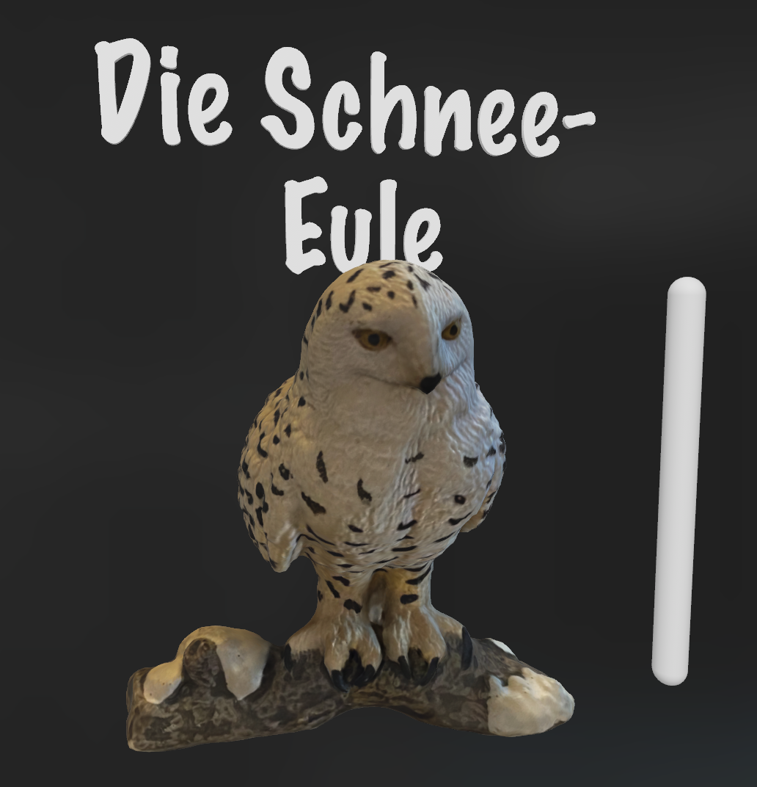
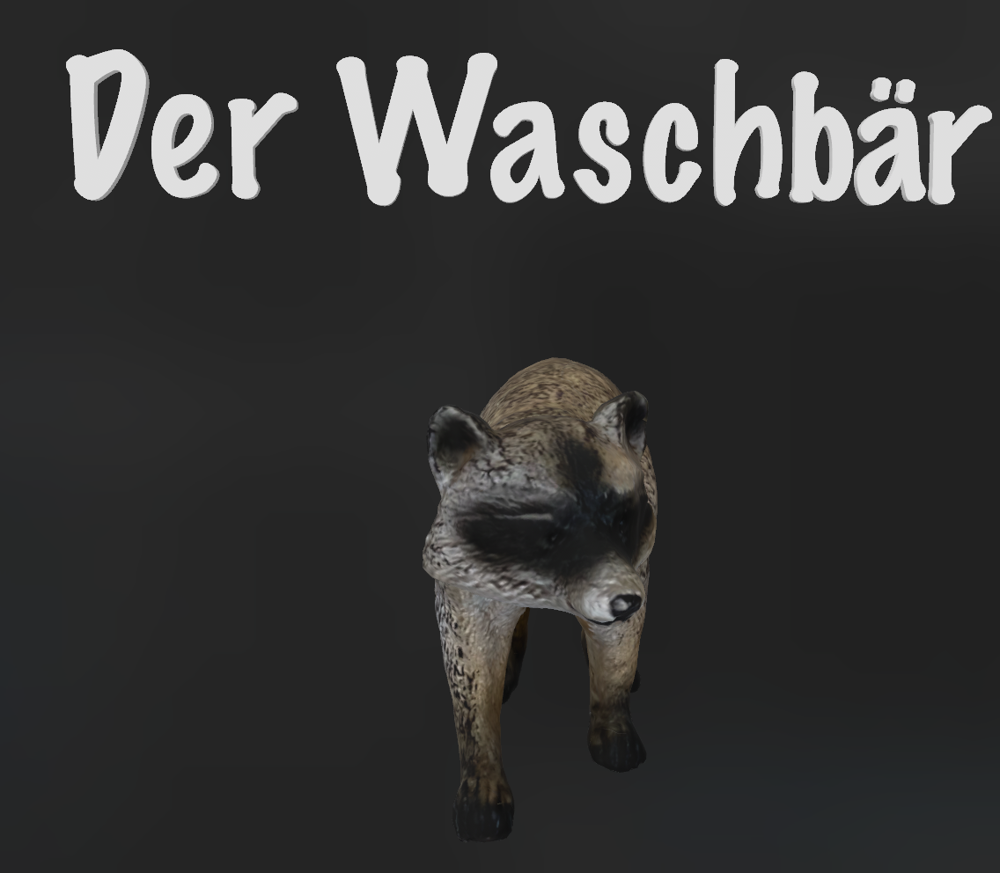

## Projects: Data Analytics and Data Science
<!-- 
Update in progress. I just finished my [DS Bootcamp at neuefische GmbH](https://www.neuefische.de/bootcamp/data-science "DS Bootcamp at neuefische GmbH") on 2023-10-16. -->

### Capstone project: Accident prophet - Traffic Accident Prediction in Hamburg

4 week capstone project on [traffic accident prediction in Hamburg (pdf presentation)](./pdf/AccidentsHH_presentation.pdf) created during my [DS Bootcamp at neuefische GmbH](https://www.neuefische.de/bootcamp/data-science "DS Bootcamp at neuefische GmbH") with python and pandas in 2023.

---

### ML project on air pollution in Africa ([Zingi Challenge](https://zindi.africa/competitions/zindiweekendz-learning-urban-air-pollution-challenge))

4 day ML project on [air pollution in Africa (pdf presentation)](./pdf/AirPollutionML_Presentation.pdf) created during my [DS Bootcamp at neuefische GmbH](https://www.neuefische.de/bootcamp/data-science "DS Bootcamp at neuefische GmbH") with python and pandas in 2023.

---

### EDA on Kings County House sales

3 day EDA on [Kings County House sales (github repository)](https://github.com/TillMeineke/ds-eda-project2023 "EDA on Kings County House sales") created during my [DS Bootcamp at neuefische GmbH](https://www.neuefische.de/bootcamp/data-science "DS Bootcamp at neuefische GmbH") with python and pandas in 2023.

---

### My CV as a barchart

[Visualisation of my CV](https://public.tableau.com/app/profile/till.meineke/viz/Lebenslauf_16860203495790/Lebenslauf?publish=yes) created with tableau in 2023. 

---

### Capstone project: Is newsletter marketing effective in preventing churn?

4 week capstone project on [churn analysis (pdf presentation)](./pdf/Presentation_is_newsletter_marketing_effective_in_preventing_churn.pdf) of subscribers of the German newspaper “Die Zeit” related to their eMail newsletter activities, created during my [DA Bootcamp at neue fische GmbH](https://www.neuefische.de/bootcamp/data-analytics "DA Bootcamp at neue fische GmbH") in 2021.

**---**

## Private projects

### AR-models from Schleich®️-toys

Fun project with photogrammetry and Reality Composer.\
View on iPhone/iPad or download with macOS.

    

    

<!--[Project 2 Title](/pdf/sample_presentation.pdf)

---
[Project 3 Title](http://example.com/)

---

### Category Name 2

- [Project 1 Title](http://example.com/)
- [Project 2 Title](http://example.com/)
- [Project 3 Title](http://example.com/)
- [Project 4 Title](http://example.com/)
- [Project 5 Title](http://example.com/)

---

--- -->
<!-- 
Page template forked from <a href="https://github.com/evanca/quick-portfolio">evanca</a>

 Remove above link if you don't want to attibute -->
